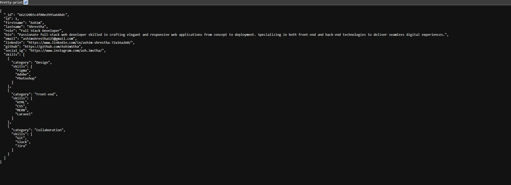
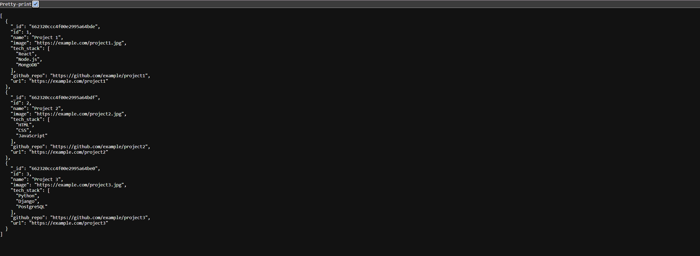
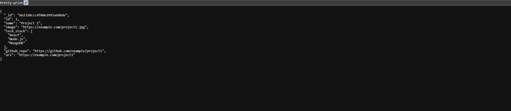

# Node Backend
The backend component to the react frontend portfolio website.

---

## Secured API settings using .env
The dot env file was added to secure the DB host information to be used in the application.

---

## To run
1. Modify the .env file values to ones which reflect your app settings.
2. Run the command `npm i` to download the node modules.
3. Run `npm run dev` to start the local server or can configure to use the MongoDB Atlas service.

---

## MongoDB User
- username: PortfolioDBuser
- password: Test123

## Atlas Credentials
- username: ashimshrestha125
- password: aLSKg5AAfKhMbcWl

**DB User Credentials**
- name: PortfolioDBUser
- password: 2cemMo4q1C3Sc3U9

---

## Images

*User Data JSON*

*All Projects JSON*

*Project Data by Id JSON*